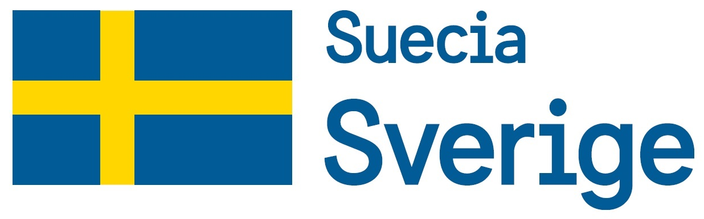

```{r setup, include=FALSE}
knitr::opts_chunk$set(echo = TRUE)
```

<br>
<br>

<center>
<h1>PRIMERA PARTE</h1>
<h2>Análisis de la conflictividad social en Bolivia</h2>
</center>
<br>

---

<b><small>La conflictividad social es parte constituyente de la dinámica sociopolítica boliviana, está estrechamente vinculada con los procesos económicos, sociopolíticos y culturales y forma parte de la vida cotidiana de la población. Conocer los conflictos y comprender su dinámica es fundamental para analizar con mayor profundidad la realidad nacional y orientar la toma de decisiones.

Desde 2006 la Fundación UNIR trabaja en el monitoreo y análisis de la conflictividad social boliviana. Cuenta con una base de datos completa y actualizada, con más de 11.500 registros, con informes periódicos sobre el tema, así como con una serie de investigación con varios títulos. 

El visualizador Conflictividad social: 10 años y + es resultado del trabajo que el Programa de Investigación en Conflictividad Social y Comunicación Democrática de UNIR viene desarrollando gracias al apoyo financiero de ASDI, la cooperación de Suecia en Bolivia. 
</small></b>
<br>
<br>
<div><center>
  
  
  </center>
  
</div>

---


