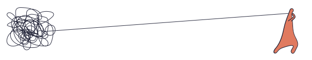

```{r setup, include=FALSE}
knitr::opts_chunk$set(echo = TRUE)
source("codigo/graficos_generales.R")
Sys.setlocale(locale = "es_ES.UTF-8")
```
<br>
<br>
<br>
<br>
<center><h1>1. Cantidad de conflictos por año</center></h1>
<br>
<br>
<small><center>12.928 conflictos en 10 años y +</center></small>
<br>
```{r, include=T, echo = F, cache.lazy = T}
n_conflictos
```
<br>
<br>
<center><h1>2. Conflictos sociales por día</center></h1>
<br>
<br>
<small><center>Cada día es un rectángulo y su color representa la frecuencia de los conflictos: más claro, mayor cantidad de casos; más oscuro, menor cantidad.	
Coloque el cursor sobre cualquier día para conocer mayores detalles.
</center></small>
<br>
```{r, include=T, echo = F, cache.lazy = T}
años_juntos
```
<br>
<br>
<center><h1>3. Promedio de conflictos por día según año</h1></center>
<br>
```{r, include=T, echo = F, fig.align='center'}
calendario
```
<br>
<br>
<br>

<br>
<br>
<br>
<center><h1>4. Tipología de los conflictos </h1></center>
<br>
<center><small>
16 tipos de conflicto según demanda

Coloque el cursor sobre el gráfico para obtener mayores detalles. 
Desactive y active las categorías de la leyenda haciendo click sobre éstas.

</small></center>
<br>
<br>
```{r, include=T, echo = F, cache.lazy = T}
razones_conflicto
```
<br>
<br>
<center><h1>5. Actores demandantes </h1></center>
<br>
<center><small>

33 sectores movilizados

Las áreas muestran la proporción (%) de los sectores movilizados respecto al total. 
Para conocer los subsectores protagonistas de los conflictos haga click sobre cada sector.

</small></center>
<br>
<br>
```{r, include=T, echo = F, cache.lazy = T}
tree_map_1
```
<br>
<br>
<center><h1>6. Actores demandados </h1></center>
<br>
<center><small>

33 receptores de demandas

Las áreas muestran la proporción (%) de los sectores demandados respecto al total. 
Para conocer los subsectores demandados haga click sobre cada sector.

</small></center>
<br>
<br>
```{r, include=T, echo = F, cache.lazy = T}
tree_map_3
```
<br>
<br>
<br>

<br>
<br>
<br>
<center><h1>7. Ubicación geográfica de los conflictos </h1></center>
<br>
</small><center>Cantidad de conflictos por municipio y año.</center></small>
<br>
```{r, include=T, echo = F, fig.width = 15, fig.height=15}
mapa_donde
```
<br>
<br>
<!-- <center><small>En 10 años los conflictos suceden en 108 municipios (32% del total). Cada  burbuja representa al municipio donde se presenta el conflicto, su tamaño muestra el número de conflictos en ese año. El cuadrado blanco en la parte inferior izquierda se usa para activar y detener la animación. Pase el mouse sobre las burbujas para ver la cantidad de conflictos por año y municipio.</small></center> -->
<!-- <br> -->
<!-- <br> -->
```{r, include=T, echo = F, cache.lazy = T}
mapa_motion
```
<br>
<br>
<center><h1>8. Ámbito de surgimiento de los conflictos </h1></center>
<br>
<center><small> Coloque el cursor sobre los segmentos del gráfico para ver la distribución de conflictos según el ámbito de su surgimiento.</small></center>
<br>
<br>
```{r, include=T, echo = F,  fig.align = "center"}
pie_ambito_total
```
<br>
<br>
```{r, include=T, echo = F,  fig.align = "center"}
facet_ambito_pie %>%
 map(hc_size, height = 300) %>%
  {print(hw_grid(.)); .} %>%
  map(tags$div, class = "col-sm-4") %>%
  tags$div(class = "row")
```
<br>
<br>
<center><h1>9. Alcance de los conflictos </h1></center>
<br>
<br>
<center><small>Coloque el cursor sobre los segmentos del gráfico para ver la distribución de conflictos según su alcance.</small></center>
<br>
<br>
```{r, include=T, echo = F,  fig.align = "center"}
pie_alcance_total
```
<br>
<br>
```{r, include=T, echo = F,  fig.align = "center"}
facet_alcance_pie %>%
 map(hc_size, height = 300) %>%
  {print(hw_grid(.)); .} %>%
  map(tags$div, class = "col-sm-4") %>%
  tags$div(class = "row")
```
<br>
<br>
<br>

<br>
<br>
<br>
<center><h1>10. Anuncio de medidas de presión  </h1></center>
<br>
<center><small>Coloque el cursor sobre el gráfico para obtener mayores detalles.
Desactive y active las categorías de la leyenda haciendo click.
</small></center>
<br>
```{r, include=T, echo = F, cache.lazy = T}
medidas_presion_1
```
<br>
<br>
<center><h1>11. Medidas de presión </h1></center>
<br>
<center><small>
25 tipos de medida de presión, las cinco más utilizadas

Coloque el cursor sobre el gráfico para mayores detalles. 
Desactive y active las categorías de la leyenda haciendo click.
</small></center>
<br>
```{r, include=T, echo = F, cache.lazy = T}
medidas_presion
```
<br>
<br>
<center><h1>12. Desenlace de los conflictos</h1></center>
<br>
```{r, include=T, echo = F, cache.lazy = T}
salidas
```
<br>
<br>
<center><h1>13. Nivel de radicalidad por año </h1></center>
<br>


## {.tabset}

### Frecuencia

```{r, echo = F}
hbr_gestion_nivel
```

### Porcentajes

```{r, echo = F}
hbr_gestion_nivel_perc
```

### Por intensiadd
<br>
<center><small> Presione sobre las barras correspondiente a cada nivel de conflictos para ver como se distribuyen los conflictos anualmente</small></center>

```{r, include=T, echo = F,  fig.align = "center"}
nivel_drill
```

## {-}

<br>
<br>
<br>

<br>
<br>
<br>
<h1>SEGUNDA PARTE</h1>
<center><h1>14. Cantidad y tipos de conflicto por año </h1></center>
<br>
<br>
<center><small> Las ondas representan la cantidad de conflictos ocurridos a lo largo del tiempo: en sentido horizontal los años y en sentido vertical los tipos de conflicto.
Coloque el cursor sobre las burbujas para ver la cantidad de conflictos ocurridos cada año, según tipo de conflicto.
</small></center>
<br>
<br>

```{r, include=T, echo = F,  fig.align = "center"}
rio_tipo
```

<br>
<br>
<center><h1>15. Duración de los conflictos por tipología </h1></center>
<br>
<center><small> Promedio de duración de los conflictos según su tipología. 
Coloque el cursor por cada círculo para ver la duración máxima y mínima, en días, de cada conflicto.
</small></center>
<br>
<br>

```{r, include=T, echo = F,  fig.align = "center"}
tipo_duracion
```
<br>
<br>
<center><h1>16.	Sectores demandantes por año</h1></center>
<br>
<center><small> Coloque el cursor sobre las áreas para ver la proporción de los movilizados por sector y por año.</small></center>
<br>
<br>

```{r, include=T, echo = F,  fig.align = "center"}
tree_map_demandante_year
```
<br>
<br>
<center><h1>17.	Sectores demandados por año </h1></center>
<br>
<center><small>Coloque el cursor sobre las áreas para ver la proporción de los movilizados por sector y por año.</small></center>
<br>
<br>

```{r, include=T, echo = F,  fig.align = "center"}
tree_map_demandado_year
```

<br>
<br>
<center><h1>18. Duración de los conflictos por sector demandante </h1></center>
<br>
<br>
<center><small> Promedio de duración de los conflictos de acuerdo al sector demandante.
Coloque el cursor por cada círculo para ver la duración máxima y mínima, en días, de cada conflicto.
</small></center>
<br>
```{r, include=T, echo = F,  fig.align = "center"}
demandado_duracion
```
<br>
<br>
<center><h1>19.	Duración de los conflictos por sector demandado</h1></center>
<br>
<br>
<center><small> Promedio de duración de los conflictos de acuerdo al sector demandando. 
Coloque el cursor por cada círculo para ver la duración máxima y mínima, en días, de cada conflicto.
</small></center>
<br>
```{r, include=T, echo = F,  fig.align = "center"}
demandado_duracion
```
<br>
<br>
<center><h1>20.	Sectores demandantes por departamento </h1></center>
<br>

<center><small> 43 sectores demandantes en los nueve departamentos.

Coloque el cursor sobre las burbujas para ver la cantidad de conflictos por sector y departamento.
</small></center>

```{r, include=T, echo = F,  fig.align = "center"}
hc_pa_bub
```
<br>
<br>
<center><h1>21.	Relación entre demandantes y demandados</h1></center>
<br>
<center><small>Interrelación conflictiva entre 43 sectores. 

Cada color representa un sector (demandante y demandado) y las líneas los conectan entre sí. El ancho de las conexiones muestra la cantidad de conflictos entre dos sectores. 
Coloque el cursor sobre los sectores y sobre las conexiones para mayores detalles.
</small></center>
<br>
<br>
```{r, include=T, echo = F, cache.lazy = T}
dependency
```
<br>
<br>

<center><h1>22.	Distribución de conflictos por municipio</h1></center>
<br>
<center><small>108 municipios con conflictos sociales. 

Cada burbuja representa un municipio con conflictos, su tamaño es acorde a la cantidad de conflictos. 
La línea en la parte inferior izquierda permite activar el año. 
Coloque el cursor sobre las burbujas para ver la cantidad de conflictos por municipio y año. 

</small></center>
<br>
<br>
VERIFICAR GRAFICO
<br><br>

<center><h1>23.	Tipos de conflicto y medidas de presión </h1></center>
<br>
<br>
<br>
<center><small>16 tipos de conflicto y 30 mil eventos (en los que se aplicaron algunos de los 25 tipos de medidas de presión existentes). 

Coloque el cursor sobre el grafico para revisar la cantidad de eventos por tipo de conflicto.
</small></center>
<br>
<br>

```{r, include=T, echo = F,  fig.align = "center"}
hcbub_tipo_medida
```
<br>
<br>
<center><h1>24.	Radicalidad de los conflictos por año</h1></center>
<br>

<center><small> Los conflictos escalan en este orden: latencia, manifestación, confrontación, enfrentamiento violento y crisis de gobernabilidad. 

Coloque el cursor sobre las barras para ver la distribución anual de los conflictos según su radicalidad.
</small></center>
<br>
<br>

## {.tabset}

### Frecuencia

```{r, echo = F}
hbr_gestion_nivel
```

### Porcentajes

```{r, echo = F}
hbr_gestion_nivel_perc
```

### Por intensiadd
<br>
<center><small> Presione sobre las barras correspondiente a cada nivel de conflictos para ver como se distribuyen los conflictos anualmente</small></center>

```{r, include=T, echo = F,  fig.align = "center"}
nivel_drill
```


<center><h1>25.	Nivel de radicalidad por sector demandante</h1></center>
<br>

<center><small> Coloque el cursor sobre los segmentos de las barras para ver la cantidad por nivel de cada demandante.  
Mientras más espacio ocupe un color mayor es la radicalidad del sector demandante. 
Active/desactive los niveles presionando en la leyenda.
</small></center>
<br>
<br>

## {.tabset}

### Frecuencia

```{r, include=T, echo = F,  fig.align = "center"}
hbr_sector_nivel
```

<br>
<br>

### Porcentaje

<br>
```{r, include=T, echo = F,  fig.align = "center"}
hbr_sector_nivel_perc
```


## {-}

<br>
<br>
<br>

<br>
<br>
<br>

<br>
<br>
<br>
<br>


<hr>

<hr>

<hr>

<center><h1>GRAFICOS DESCARTADOS</h1></center>


<center><h1>¿QUÉ DEMANDAN QUIENES DEMANDAN?</small></center>
<br>
<center><small> Pase el mouse sobre los conflictos para ver la cantidad por tipo de cada demandante. Este gráfico ha sido porcentualizado, por tanto, mientras más espacio ocupe algún color (Tipo de conflictividad) es mayor su ejercicio por ese demandante. Puede activar/desactivar los tipos presionando éstos en la leyenda</small></center>

<br>
<br>
```{r, include=T, echo = F,  fig.align = "center"}
hbr_sector_tipo
```


